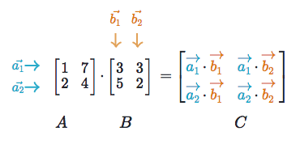

# Motivation
When I implmented gradient descent from scratch, I was very confused which method to use for dot product or matrix multiplications - `np.multiply` or `np.dot` or `np.matmul`? Should I keep the weight array as a 1D array or 2D array? Should I keep it as a row vector or column vector? So, I decided to investigate all the options and come up with the best approach to take.  

In this notebook, I will review what dot product and matrix multiplication are and compare 5 different options in NumPy (`*`, `np.multiply`, `np.dot`, `np.matmul`, and `@`) to understand the differences between them. 

**Table of contents**  
1. [What is dot prodcut?](#dot_product)
2. [What is matrix multiplication?](#matrix_multiplication)
3. [What is available for NumPy arrays?](#numpy_array)  
    (1) [element-wise multiplication: * and sum](#asterisk)  
    (2) [element-wise multiplication: np.multiply and sum](#np.multiply)  
    (3) [dot product: np.dot](#np.dot)  
    (4) [matrix multiplication: np.matmul](#np.matmul)  
    (5) [matrix multiplication: @](#@)  
4. [So.. what's with np.not vs. np.matmul (@)?](#dot_vs_matmul)  
5. [Summary](#summary)  
6. [Reference](#reference)

<a id="dot_product"></a>
# 1. What is dot prodcut?

The dot product is an algebraic operation that takes two same-sized vectors and returns a single number.   

**Algebraic definition**  
The dot product is the sum of the products of the corresponding entries of the two sequences of numbers. [Wikipedia](https://en.wikipedia.org/wiki/Dot_product)
$$
a = 
\begin{bmatrix}
a_1 & a_2 & ... & a_n
\end{bmatrix} \\
b =
\begin{bmatrix}
b_1 & b_2 & ... & b_n
\end{bmatrix} \\
a \cdot b = \sum_{i=1}^{n} a_i b_i
$$

If $a$ and $b$ are row matrices, the dot product can be written as a matrix product. 
$$
a \cdot b = ab^\intercal
$$

For example, if $a = [a_1 \ a_2 \ a_3]$ and $b = [b_1 \ b_2 \ b_3]$, it becomes
$$[a_1 \ a_2 \ a_3]
\begin{bmatrix}
b_1 \\
b_2 \\
b_3
\end{bmatrix}
=a_1b_1 + a_2b_2 + a_3b_3
$$


**Geometric definition**  
Geometrically, the dot product is the product of the Euclidean magnitudes of two vectors and the cosine of the angle between two. [Wikipedia](https://en.wikipedia.org/wiki/Dot_product)  

$$ a \cdot b = \vert a \vert \vert b \vert \rm cos \theta $$  

Note that it is based on how much of one vector is in the direction of the other vector (projection). For example, in the below picture, the component of $A$ that is in the $B$ direction is $\vert A \vert \rm cos \theta$. Here, the magnitude of $A$ can be calculated by $\vert A \vert = \sqrt{x^2 + y^2}$ if $A = (x, y)$ and the initial point is the origin.([Picture](https://en.wikipedia.org/wiki/Dot_product))    


Also note that if the two vectors are in the same direction, $\rm cos \theta = \rm cos 0^{\circ} = 1$ so it simply becomes the multiplication of the magnitude of the two vectors $a \cdot b = \vert a \vert \vert b \vert$. On the other hand, if the two vectors are perpendicular, $\rm cos \theta = \rm cos 90^{\circ} = 0$ so the whole dot product becomes 0. 


**Real world example**  
So what does the dot product really mean to us? How can we use it in the real life?  
Imagine you are in a grocery store. You want to buy 1 apple, 2 oranges, and 3 bananas. The unit prices are \\$1, \\$2, \\$0.5, respectively. [Image source](https://www.thestar.com/life/food_wine/2013/11/04/apples_oranges_or_bananas_which_fruit_is_nutritionally_the_best.html)


You can define a number of items vector ($a$) and a unit price vector ($b$).  
$$
a = \begin{bmatrix}1 & 2 & 3 \end{bmatrix}\\
b = \begin{bmatrix}\$1 & \$2 & \$0.5\end{bmatrix}
$$

The total cost will be the dot product of the two vectors:
$$ 
ab^\intercal = 
\begin{bmatrix}
1 & 2 & 3
\end{bmatrix}
\begin{bmatrix}
\$1 \\
\$2 \\
\$0.5
\end{bmatrix}
=1 \times \$1 + 2 \times \$2 + 3 \times \$0.5 = \$6.5 
$$


<a id="matrix_multiplication"></a>
# 2. What is matrix multiplication?

Now, let's talk about matrix multiplication. How is it different from dot product?  

Matrix multiplication is basically a matrix version of the dot product. Remember the result of dot product is a scalar. The result of matrix multiplication is a matrix, whose elements are the dot products of pairs of vectors in each matrix. [(Picture)](https://ml-cheatsheet.readthedocs.io/en/latest/linear_algebra.html)



Note that the number of columns of $A$ and the number of rows of $B$ should match; $A: (m \times n)$, $B: (n \times k)$.  

**Grocery example**  
Let's go back to the previous grocery store example. Let us say that now there are two people who want to buy different numbers of apples, oranges, and bananas.  
Person 1 wants 1 of each fruit: $a_1 = [1 \ \ 1 \ \ 1]$  
Person 2 wants 10 of each fruit: $a_2 = [10 \ \ 10 \ \ 10]$

Then we can make a matrix out of the two vectors: 
$$
A= 
\begin{bmatrix}
a_1\\
a_2
\end{bmatrix}=
\begin{bmatrix}
1 & 1 & 1\\
10 & 10 & 10
\end{bmatrix}
$$  

Now, instead of just using b as a row vector, we need to transpose b to make it a column vector. 
$$
B = 
\begin{bmatrix}
\$1\\
\$2\\
\$0.5
\end{bmatrix}
$$

Now the total price each person has to pay is: 

$$
A \cdot B = 
\begin{bmatrix}
1 & 1 & 1\\
10 & 10 & 10
\end{bmatrix}
\begin{bmatrix}
\$1\\
\$2\\
\$0.5
\end{bmatrix} = 
\begin{bmatrix}
1 \times \$1 + 1 \times \$2 + 1 \times \$0.5 \\
10 \times \$1 + 10 \times \$2 + 10 \times \$0.5
\end{bmatrix} =
\begin{bmatrix}
\$3.5 \\
\$35 
\end{bmatrix}
$$ 

So the person 1 should pay \\$3.5 and person 2 should pay \\$35.

<a id="numpy_array"></a>
# 3. What's available for NumPy arrays? 

So, our goal is to find the best method in NumPy to perform dot product or matrix multiplication. I compared five different options in three different categories:  

1. element-wise multiplication: `*` , `np.multiply` with `sum`
2. dot product: `np.dot` 
3. matrix multiplication: `np.matmul`, `@`  

We will go through different scenarios depending on the dimension of a vector/matrix and understand the pros and cons of each method.


```python
import numpy as np
```

<a id="asterisk"></a>
## (1) element-wise multiplication: * and sum

First, you can try a fundamental approach using element-wise multiplication; take each element in two vectors, multiply, and then sum all the output values. The downside of this is that you need two separate operations to perform the dot product and this is slower than other methods we will review later. 


```python
a = np.array([1, 2, 3])
b = np.array([4, 5, 6])

>>> a*b
array([ 4, 10, 18])
>>> sum(a*b)
32
```


Let's look at a 2D array.


```python
c = np.array([[1, 2, 3], [4, 5, 6]])
d = np.array([1, 1, 1])

>>> c*d
array([[1, 2, 3],
       [4, 5, 6]])
```


Here, each row of 2D array $c$ is considered as an element of the matrix and it is paired with the second array $d$ for element-wise multiplication.  

$$
\begin{bmatrix}
[1 & 2 & 3] * [1 & 1 & 1]  \\
[4 & 5 & 6] * [1 & 1 & 1] 
\end{bmatrix} = 
\begin{bmatrix}
[1 \times 1 & 2 \times 1 & 3 \times 1] \\
[4 \times 1 & 5 \times 1 & 6 \times 1]
\end{bmatrix}
=\begin{bmatrix}
1, 2, 3  \\
4, 5, 6 
\end{bmatrix}
$$

If it was matrix multiplication, it would have been as follows.

$$
\begin{bmatrix}
1 & 2 & 3  \\
4 & 5 & 6
\end{bmatrix}
\begin{bmatrix}
1 \\
1 \\
1 \\
\end{bmatrix} = 
\begin{bmatrix}
1 \times 1 + 2 \times 1 + 3 \times 1 \\
4 \times 1 + 5 \times 1 + 6 \times 1
\end{bmatrix}
=\begin{bmatrix}
6  \\
15
\end{bmatrix}
$$

Therefore, to get the same output, you need to apply `np.sum` to the initial output. Note that you should pass parameter `axis=1` otherwise it will sum elements in the same column first. 


```python
>>> np.sum(c*d, axis=1)
array([ 6, 15])
```


<a id="np.multiply"></a>
## (2) element-wise multiplication: np.multiply and sum
`np.multiply` is basically the same as `*`. It is an element-wise multiplication so you need to sum to get the final scalar output. 


```python
a = np.array([1, 2, 3])
b = np.array([4, 5, 6])

>>> np.multiply(a, b)  # array([ 4, 10, 18])
sum(np.multiply(a, b))  # 32
```


<a id="np.dot"></a>
## (3) dot product: np.dot
There is a nicer and simpler option in NumPy, which is `np.dot`. You can use either `np.dot(a, b)` or `a.dot(b)`. You don't need to multiply the elements and then sum them. Simple and easy.


```python
a = np.array([1, 2, 3])
b = np.array([4, 5, 6])

>>> np.dot(a, b)
32
```


However, you need to be careful when it is a higher dimension. If the dimension of the array is 2D or higher, make sure the number of columns of the first array matches with the number of rows in the second array. 


```python
a = np.array([[1, 2, 3]])  # shape (1, 3)
b = np.array([[4, 5, 6]])  # shape (1, 3)

>>> np.dot(a, b)  
# ValueError: shapes (1,3) and (1,3) not aligned: 3 (dim 1) != 1 (dim 0)
```


To make the above example work, you need to transpose the second array so that the shapes are aligned: (1, 3) x (3, 1). **Note that this will return (1, 1), which is a 2D array.** 


```python
a = np.array([[1, 2, 3]])  # shape (1, 3)
b = np.array([[4, 5, 6]])  # shape (1, 3)

>>> np.dot(a, b.T)  
array([[32]])
```


You can now guess that if the second array is a 1D array with shape (3, ) the output array will be a 1D array. Let's check it. 


```python
a = np.array([[1, 2, 3]])  # shape (1, 3)
b = np.array([4, 5, 6])  # shape (3, )

>>> np.dot(a, b)  
array([32])
```


**Also be careful with the order of the input arrays. If the order is opposite, you may get outer product instead of inner product (dot product).**


```python
a = np.array([[1, 2, 3]])  # shape (1, 3)
b = np.array([[4, 5, 6]])  # shape (1, 3)

>>> np.dot(a.T, b)  # (3, 1) x (1, 3) 
array([[ 4,  5,  6],
       [ 8, 10, 12],
       [12, 15, 18]])
```


Okay, they are 2D arrays but still 1 dimensional row or column vectors. Will this method work for the previous 2D array x 2D array example as well? 


```python
c = np.array([[1, 2, 3], [4, 5, 6]])  # shape (2, 3)
d = np.array([[1], [1], [1]])  # shape (3, 1)

>>> np.dot(c, d)
array([[ 6],
       [15]])
```


Yes! **Even if it is called `dot`, which indicates that the inputs are 1D vectors and the output is a scalar as in the definition, it works for 2D or higher dimensional matrices as if it was a matrix multiplication.** In the above example,  
$$
\begin{bmatrix}
1, 2, 3 \\
4, 5, 6 
\end{bmatrix}
\begin{bmatrix}
1 \\
1 \\
1 \\
\end{bmatrix} =
\begin{bmatrix}
1 \times 1 + 2 \times 1 + 3 \times 1 \\
4 \times 1 + 5 \times 1 + 6 \times 1 \\
\end{bmatrix} =
\begin{bmatrix}
6 \\
15 \\
\end{bmatrix}
$$


This is what we wanted! This wasn't working in the `*` or `np.multiply` so it is definitely an improvement. **So, should we use `np.dot` to all our dot product and matrix multiplication?** 

Technically yes but no. It is not recommended to use `np.dot` for matrix multiplication because the name dot product has a specific meaning and it can be confusing to readers (especially mathematicians!). [Reference](https://blog.finxter.com/numpy-matmul-operator/#Python_@_Operator)

Also, it is not recommended for high dimensional matrices (3D or above) because `np.dot` behaves different from normal matrix multiplication. We will discuss this later after seeing two more options. 

<a id="np.matmul"></a>
## (4) matrix multiplication: np.matmul
So the next option is `np.matmul` and **it is designed for matrix multiplication and even the name comes from it** (**MAT**rix **MUL**tiplication). Although the name says matrix multiplication, it also works with 1D array just like dot product. Let's try the examples that we tested for `np.dot`. So, `np.matmul` works same as `np.dot` for 1D and 2D arrays. 


```python
# 1D array
a = np.array([1, 2, 3])  # shape (1, 3)
b = np.array([4, 5, 6])  # shape (1, 3)

>>> np.matmul(a, b)
32
```


```python
# 2D array with values in 1 axis
a = np.array([[1, 2, 3]])  # shape (1, 3)
b = np.array([[4, 5, 6]])  # shape (1, 3)

>>> np.dot(a, b.T) 
array([[32]])
```


```python
# 2D arrays
c = np.array([[1, 2, 3], [4, 5, 6]])  # shape (2, 3)
d = np.array([[1], [1], [1]])  # shape (3, 1)

>>> np.dot(c, d)
array([[ 6],
       [15]])
```


Nice! So, **this means both `np.dot` and `np.matmul` work perfectly for dot product and matrix multiplication.** However, as we said before, it is recommended to use `np.dot` for dot product and `np.matmul` for 2D or higher matrix multiplication.

<a id="@"></a>
## (5) matrix multiplication: @

Here comes the last option! `@` is a new operator that was introduced since Python 3.5, whose name comes from m**AT**rices. **It is basically same as `np.matmul` and designed to perform matrix multiplication**. But why do we need a new infix if we already have `np.matmul` that works perfectly fine? 

**The major motivation for adding a new operator to stdlib was that the matrix multiplication is a so common operator that it deserves its own infix**. For example, the operator `//` is much more uncommon than matrix multiplication but still has its own infix. To learn more about the background of this addition, check out this [PEP 465](https://www.python.org/dev/peps/pep-0465/).


```python
# 1D array
a = np.array([1, 2, 3])  # shape (1, 3)
b = np.array([4, 5, 6])  # shape (1, 3)

>>> a @ b  
32
```


```python
# 2D array with values in 1 axis
a = np.array([[1, 2, 3]])  # shape (1, 3)
b = np.array([[4, 5, 6]])  # shape (1, 3)

>>> a @ b.T
array([[32]])
```


```python
# 2D arrays
c = np.array([[1, 2, 3], [4, 5, 6]])  # shape: (2, 3)
d = np.array([[1], [1], [1]])  # shape: (3, 1)

>>> c @ d
array([[ 6],
       [15]])
```


So, it works exactly same as `np.matmul`. **But which one should you use between `np.matmul` and `@` then?** Although it is your preference, `@` looks cleaner than `np.matmul`. For example, if we want to perform matrix multiplication for 3 different matrices $x, y, z$ 

`np.matmul` version is: `np.matmul(np.matmul(x, y), z)`  
whereas `@` version is: `x @ y @ z`  

**So, `@` is much more cleaner and readable. However, if you are using Python version below 3.5, you have to use `np.matmul`.**

<a id="dot_vs_matmul"></a>
# 4. So.. what's with np.not vs. np.matmul (@)?

In the above section, I mentioned that np.dot is not recommended for high dimensional arrays, so what do I mean?  

There was an interesting [question](https://stackoverflow.com/questions/34142485/difference-between-numpy-dot-and-python-3-5-matrix-multiplication) in stackoverflow about different behaviors between `np.dot` and `@`. Let's looks at this.


```python
a = np.random.rand(3,2,2)  # 2 rows, 2 columns, in 3 layers 
b = np.random.rand(3,2,2)  # 2 rows, 2 columns, in 3 layers 
c = np.dot(a, b)
d = a @ b  # Python 3.5+

>>> c.shape  # np.dot
(3, 2, 3, 2)
>>> d.shape  # @
(3, 2, 2)
```
 
How is this possible? This is because of how it is defined. If I take the [most voted answer](https://stackoverflow.com/a/34142617/9449085) here: 

=======================  
From the documentation:

`matmul` differs from `dot` in two important ways.  

- Multiplication by scalars is not allowed.
- Stacks of matrices are broadcast together as if the matrices were elements.  


The last point makes it clear that dot and matmul methods behave differently when passed 3D (or higher dimensional) arrays. Quoting from the documentation some more:

For `matmul`:
> If either argument is N-D, N > 2, it is treated as a stack of matrices residing in the last two indexes and broadcast accordingly.

For `np.dot`:
> For 2-D arrays it is equivalent to matrix multiplication, and for 1-D arrays to inner product of vectors (without complex conjugation). For N dimensions it is a sum product over the last axis of a and the second-to-last of b

=======================

And the [official document](https://numpy.org/doc/stable/reference/generated/numpy.dot.html) 
> If a is an N-D array and b is an M-D array (where M>=2), it is a sum product over the last axis of a and the second-to-last axis of b:  
> $ dot(a, b)[i,j,k,m] = sum(a[i,j,:] * b[k,:,m])$

So, long story short, in the normal matrix multiplication situation where we want to treat each stack of matrices in the last two indexes, we should use `matmul`. 

<a id="summary"></a>
# 5. Summary

- `*` == `np.multiply` != `np.dot` != `np.matmul` == `@`
- `*` and `np.multiply` need `sum` to perform dot product. Not recommended for dot product or matrix multiplication.
- `np.dot` works for dot product and matrix multiplication. However, recommended to avoid using it for matrix multiplication due to the name. 
- `np.matmul` and `@` are the same thing, designed to perform matrix multiplication. `@` is added to Python 3.5+ to give matrix multiplication its own infix. 
- `np.dot` and `np.matmul` generally behave similarly other than 2 exceptions: 1) `matmul` doesn't allow multiplication by scalar, 2) the calculation is done differently for N>2 dimesion. Check the documentation which one you intend to use. 

One line summary: 

- **For dot product, use `np.dot`. For matrix multiplication, use `@` for Python 3.5 or above, and `np.matmul` for earlier Python versions.**   

<a id="reference"></a>
# 6. Reference
- [NumPy Matrix Multiplication — np.matmul() and @](https://blog.finxter.com/numpy-matmul-operator/)
- [numpy.dot official document](https://numpy.org/doc/stable/reference/generated/numpy.dot.html)
- [PEP 465 -- A dedicated infix operator for matrix multiplication](https://www.python.org/dev/peps/pep-0465/)
- [Difference between numpy dot() and Python 3.5+ matrix multiplication @](https://stackoverflow.com/questions/34142485/difference-between-numpy-dot-and-python-3-5-matrix-multiplication)

